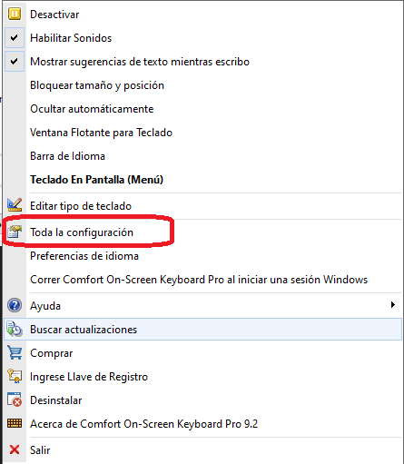
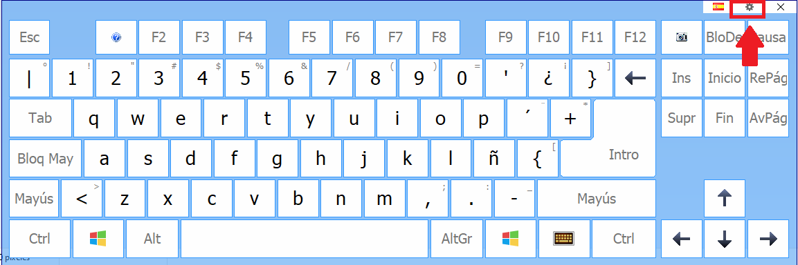
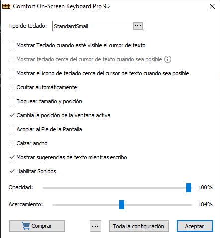
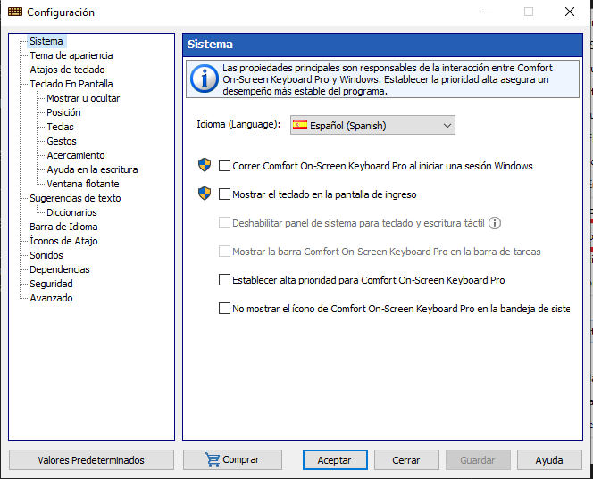

1. [Ajustes](#1-ajustes)
2. [Configuración de la red WIFI](#2-configuración-de-la-red-wifi)
3. [Problemas con conectividad](#3-problemas-con-conectividad)

## 1. Ajustes

Para abrir el cuadro de diálogo **Configuración** , haga clic con el botón derecho en el icono de Comfort On-Screen Keyboard Pro en la bandeja del sistema y seleccione el elemento **Toda la  Configuración** en el menú contextual.

O presione la tuerca que aparece en la esquina superior derecha de la ventana del teclado.

Se procederá a abrir la siguiente ventana.

La ventana muestra opciones de ajustes rápidos para editar. Para acceder a una configuración completa, debe presionar en **Toda la configuración**, se procederá a abrir la siguiente ventana.

