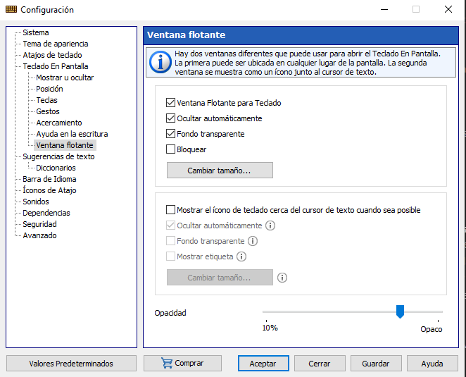

1. [Ajustes](#1-ajustes)
2. [Posición](#2-posición)
3. [Acercamiento](#3-acercamiento)
3. [Ventana flotante](#4-Ventana-flotante)

## 1. Ajustes

Para abrir el cuadro de diálogo **Configuración** , haga clic con el botón derecho en el icono de Comfort On-Screen Keyboard Pro en la bandeja del sistema y seleccione el elemento **Toda la  Configuración** en el menú contextual.

O presione la tuerca que aparece en la esquina superior derecha de la ventana del teclado.

Se procederá a abrir la siguiente ventana.

La ventana muestra opciones de ajustes rápidos para editar. Para acceder a una configuración completa, debe presionar en **Toda la configuración**, se procederá a abrir la siguiente ventana.

## 2. Posición

Con esta configuración, puede especificar la ubicación del teclado en pantalla.

- **Bloquear:** Evita que el teclado se mueva.
- **Muestre el teclado en pantalla junto al área de entrada de texto cuando sea posible:** Algunas aplicaciones dibujan el cursor de texto a su manera y no proporcionan información sobre su posición (estas son Firefox, OpenOffice, CorelDRAW, etc.). En este caso, el teclado se mostrará en la parte inferior de la pantalla.

---
**NOTA:**
Esta función no funciona cuando configura la configuración de acoplamiento.

---

- **Mover el teclado en pantalla a un borde de la pantalla:** Cuando aparezca el teclado en pantalla, se moverá automáticamente al borde de la pantalla especificado (incluso si se había movido a otro lugar). Si el usuario mueve el teclado a cualquier lugar de la pantalla, permanecerá en ese lugar hasta que desaparezca.

- **Acoplamiento:** Puedes acoplar el teclado en la parte superior o inferior de la pantalla. Si se acopla el teclado, el espacio disponible en el escritorio se reducirá. Las ventanas de otras aplicaciones y los iconos del escritorio se reorganizarán para ajustarse al cambio.

## 3. Acercamiento

Puede acercar para obtener una vista de primer plano de su teclado, o alejar para ver más del escritorio. Esta función le permite cambiar el tamaño del teclado sin editarlo.

- **Calzar ancho:** Puede escalar automáticamente el teclado en pantalla para que coincida con el ancho de la pantalla. Esta función es útil si cambia con frecuencia la pantalla entre los modos vertical y horizontal.

- **Ancho:** La relación de escala de ancho del teclado. Puede cambiar el tamaño de la ventana del teclado de la manera habitual, arrastrando su borde con el mouse.

- **Calzar alto:** Puede escalar automáticamente el teclado en pantalla para que coincida con la altura de la pantalla. Si esta opción se usa junto con Ajustar ancho , el teclado se ajustará al tamaño de la pantalla.

- **Altura:** La relación de escala de altura del teclado.

- **Bloquear relación de aspecto:** Si esta relación está bloqueada, el ancho del teclado se escalará en la misma proporción que su altura (y viceversa, la altura se escalará en la misma proporción que el ancho).

- **Fijar el tamaño de la ventana:** Puede evitar que el teclado cambie de tamaño.

- **Pellizque o estire para hacer zoom cuando use una pantalla táctil:** Para acercar o alejar, toque el teclado en pantalla con dos dedos y luego mueva los dedos uno hacia el otro (pellizcar) o alejándolos (estirar).

## 4. Ventana flotante

Hay dos ventanas diferentes que puede usar para abrir el teclado en pantalla.

1. La primera ventana ("Ventana Flotante para Teclado"), que se puede colocar en cualquier lugar de la pantalla, le permite mostrar u ocultar el teclado en pantalla.

2. La segunda ventana ("Mostrar el icono flotante del teclado en pantalla junto al cursor de texto") se muestra como un icono ubicado junto al cursor de texto. Si no hay un cursor de texto en la pantalla, esta ventana no se mostrará.

Puede cambiar el tamaño de cualquiera de estas ventanas, ajustar su transparencia o hacer que desaparezcan automáticamente cuando se muestra el teclado en la pantalla.

- **Auto-escondite:** Puede ocultar estas ventanas cuando el teclado en pantalla está visible y mostrarlas cuando el teclado está oculto.

- **Fondo transparente:** Mostrar solo el icono y la etiqueta.

- **Mostrar el icono flotante del teclado en pantalla junto al cursor de texto:** Puede hacer que un icono flotante aparezca automáticamente cuando toca una ubicación de la pantalla donde desea insertar su texto. Para abrir el teclado en pantalla, toque el icono flotante.

---
**NOTA:**
Algunas aplicaciones dibujan el cursor de texto a su manera y no proporcionan información sobre su posición. (Estos son Firefox, Google Chrome, OpenOffice, CorelDRAW, etc.) En este caso, el icono flotante no se mostrará.

---