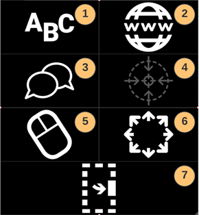
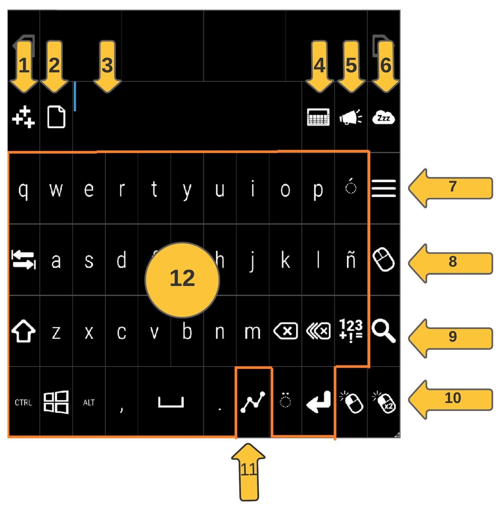
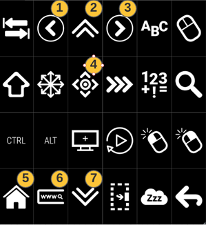
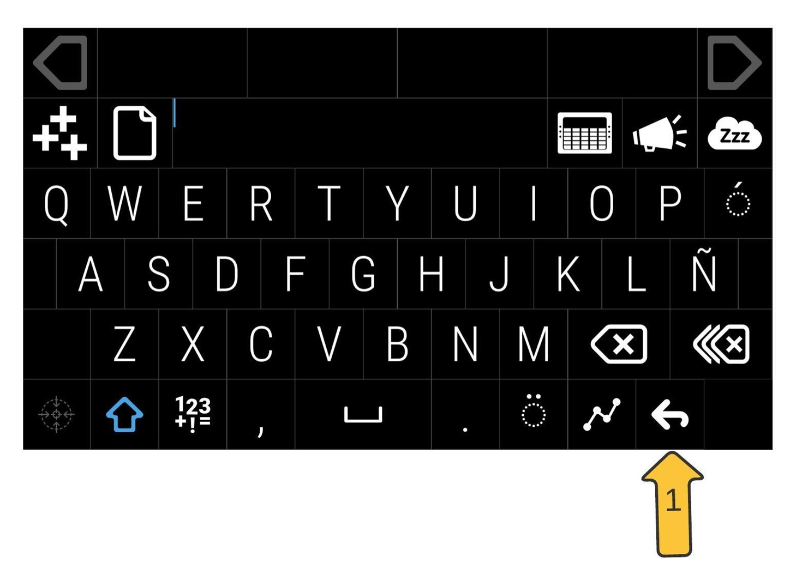
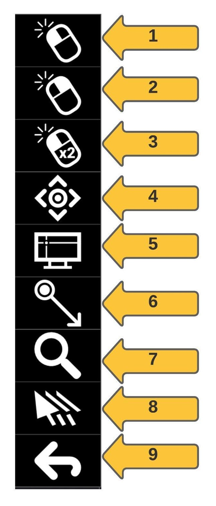
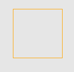
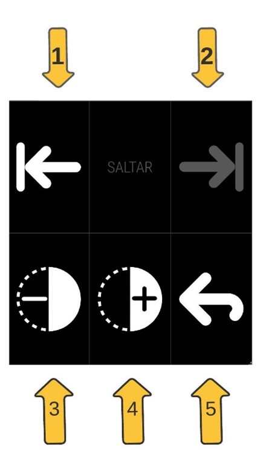

## Contenido

1. [Estado inicial del programa](#1-estado-inicial-del-programa)
2. [OpenEyes – Funciones del menú principal](#2-openeyes--funciones-del-menú-principal)
    - [2.1. Letras](#21-letras)
        - [2.1.1. Funciones de sección letras](#211-funciones-de-sección-letras)
            - [Agregar al diccionario](##1-agregar-al-diccionario)
            - [Copiar](#2-copiar)
            - [Bloc de notas](#3-bloc-de-notas)
            - [Communikate](#4-communikate)
            - [Hablar](#5-hablar)
            - [Suspender](#6-suspender)
            - [Menú](#7-menú)
            - [Cursor](#8-cursor)
            - [Lupa](#9-lupa)
            - [Acciones del cursor](#10-acciones-del-cursor)
            - [Selección múltiple](#11-selección-múltiple)
            - [Teclado](#12-teclado)
    - [2.2. Web Browsing](#22-web-browsing)
        - [2.2.1 Funciones del menú web browsing](#221-funciones-del-menú-web-browsing)
            - [Browser back](#1-browser-back)
            - [Inicio](#2-inicio)
            - [Browser forward](#3-browser-forward)
            - [Look to scroll](#4-look-to-scroll)
            - [Browser home](#5-browser-home)
            - [Browser search](#6-browser-search)
            - [Fin](#7-fin)
    - [2.3. Conversación](#23-conversación)
    - [2.4. Volver a calibrar](#24-volver-a-calibrar)
    - [2.5. Cursor](#25-cursor)
        - [2.5.1 Funciones del menú del cursor](#251-funciones-del-menú-del-cursor)
            - [Clic izquierdo](#1-clic-izquierdo)
            - [Clic derecho](#2-clic-derecho)
            - [Doble clic izquierdo](#3-doble-clic-izquierdo)
            - [Scroll](#4-scroll)
            - [Punto de fijación](#5-punto-de-fijación)
            - [Clic y arrastrar](#6-clic-y-arrastrar)
            - [Lupa](#7-lupa)
            - [Cursor magnético](#8-cursor-magnético)
            - [Volver](#9-volver)
    - [2.6. Tamaño y posición](#26-tamaño-y-posición)
        - [2.6.1 Funcionalidades tamaño y posición](#261-funcionalidades-tamaño-y-posición)
            - [Saltar izquierda](#1-saltar-izquierda)
            - [Saltar derecha](#2-saltar-derecha)
            - [Menos tenue](#3-menos-tenue)
            - [Más tenue](#4-más-tenue)
            - [Volver](#5-volver)
    - [2.7. Minimizar](#27-minimizar)

## 1. Estado inicial del programa

Cuando la aplicación se encuentra en uso se encontrará con el siguiente ícono en la parte derecha de su pantalla.

Al fijar su mirada por un instante se muestra que se empieza a generar un círculo, como se muestra a continuación.

Cuando se completa el circulo se ejecuta la acción del botón seleccionado, en este caso es la apertura del menú principal como se muestra a continuación.

_Imagen 1: menú principal OpenEyes._

**Para activar cualquier botón del programa OpenEyes debe esperar a que el circulo se complete para ejecutar la acción.**

## 2. OpenEyes – Funciones del menú principal

Cuando se fija la mirada sobre los iconos del menú principal, aparecerá los nombres de cada sección del menú. Las siguientes secciones esta descrito las acciones de cada sección del menú principal, está relacionado con la imagen 1.

### 2.1. Letras

Una vez que seleccione el ícono de letras con la mirada se encontrara con lo siguiente:

_Imagen 2: funciones generales de letras._

#### 2.1.1 Funciones de sección letras

La siguiente numeración está relacionada con lo mostrado en la imagen 2.

##### 1. Agregar al diccionario

Almacena la palabra que este escrita en el block de notas para posteriores usos.

##### 2. Copiar

Permite copiar lo que se encuentre escrito en block de notas y así poder pegarlo en otra sección.

##### 3. Bloc de notas

Cumple la función de registrar lo seleccionado en la aplicación OpenEyes.

##### 4. Communikate

Abre una nueva ventana con palabras o frases registradas, estas palabras están asociadas a imágenes que permiten una mejor interacción.

##### 5. Hablar

Todo lo que este escrito en la sección de bloc de notas se podrá escuchar por audio.

##### 6. Suspender

Permite congelar o pausar la aplicación para observar lo mostrado por pantalla sin activar ninguna tecla del programa OpenEyes.

##### 7. Menú

Permite regresar al menú principal.

##### 8. Cursor

Permite llegar directamente al menú del cursor.

##### 9. Lupa

Permite agrandar parte de la pantalla, para activar esta función se debe mirar el ícono de lupa hasta que quede seleccionado (cuando este seleccionado quedara marcado de color azul) y posteriormente se debe ir a la función de clic izquierdo hasta que se seleccione, finalmente debe dirigir la mirada hacia la zona donde quiere aplicar la lupa y esperar a que se ejecute la acción.

##### 10. Acciones del cursor

Cuenta con la función de clic izquierdo del cursor y doble clic izquierdo del cursor.

##### 11. Selección múltiple

Permite la escritura rápida, cuando se activa este botón debe mirar la primera letra de la palabra que desea escribir, esta se quedara marcada, luego debe mirar el resto de la palabra a excepción de la última letra sin la necesidad de esperar el tiempo de activación para que se escriba y finalmente mirar la última letra hasta que se complete el tiempo de activación, cuando se activa la letra seleccionada se escribe la palabra que desea expresar en el bloc de notas.

Por ejemplo, si deseo escribir &quot;HOLA&quot;, activo el botón de selección múltiple, miro la letra &quot;H&quot; hasta que se escriba en el bloc de notas, luego miro las letras &quot;O&quot; &quot;L&quot; pero sin activar la acción de escribir, finalmente miro la letra &quot;A&quot; hasta que el circulo este completo (se active la acción de escribir) y se debe escribir la palabra en el bloc de notas.

##### 12. Teclado

Representa las acciones de un teclado de computador.

### 2.2. Web Browsing

Cuando se activa la sección de web browsing se muestra el siguiente menú.

_Imagen 3: menú de web browsing._

#### 2.2.1 Funciones del menú web browsing

Se debe mencionar que las funciones que no se encuentran numeradas en la imagen 3 se debe a que existe su explicación en otra sección del documento.

##### 1. Browser back

Al accionar este botón se permite volver a la página anterior.

##### 2. Inicio

Al accionar este botón permite subir hasta el comienzo de la página.

##### 3. Browser forward

Al accionar este botón se permite adelantar a la pagina siguiente si es que existe alguna visitada.

##### 4. Look to scroll

Al accionar este botón ocurre lo explicado en menú del cursor, botón 4.

##### 5. Browser home

Al accionar este botón la pagina del navegador se redirige a la pagina principal.

##### 6. Browser search

Al accionar este botón se acciona la barra del buscador del navegador.

##### 7. Fin

Al accionar este botón la página se moverá al final del contenido.

### 2.3. Conversación

Cuando se activa la sección de conversación del menú principal se muestra la siguiente imagen que ocupa todo el espacio de la pantalla.

_Imagen 4: teclado de conversación._

Cuenta con la mayoría de las funciones explicadas en la sección de letras. Un cambio que se debe mencionar es que aparece un botón con una nueva función, la imagen marca el botón volver (marcado como 1 en la imagen 4) que permite volver al menú principal.

### 2.4. Volver a calibrar

Al activar el botón de calibración se abre el programa de &quot;tobii experience&quot; que permite hacer una prueba de calibración y ajustar el punto de fijación de la mira.

### 2.5. Cursor

Al activar cursor, aparece el siguiente menú que nos permite representar algunas de las acciones que se pueden realizar con el cursor.

_Imagen 5: menú del cursor._

#### 2.5.1 Funciones del menú del cursor

##### 1. Clic izquierdo

Simula el clic izquierdo del cursor, para activar esta función debe mirar el ícono, esperar a que se complete el circulo y se accione el botón, luego mirar su objetivo que desea chiclear y esperar hasta que se complete el circulo nuevamente para realizar la acción del clic izquierdo del cursor.

##### 2. Clic derecho

Simula el clic derecho del cursor. Se activa de la misma manera que &quot;clic izquierdo&quot;.

##### 3. Doble clic izquierdo

Simula el doble clic derecho del cursor. Se activa de la misma manera que &quot;clic izquierdo&quot;.

##### 4. Scroll

Simula el accionar de mover la pantalla (hacia arriba o hacia abajo) con la rueda del cursor, para activar debe mirar el ícono hasta que se acción el botón y luego debe mirar en el lugar donde quiere activar la función (preferentemente en el centro de la pantalla), esto marcara un cuadrado en su pantalla como se muestra en la siguiente imagen.

_Imagen 6: muestra de resultado al accionar &quot;scroll&quot;._

Finalmente, cuando aparezca el cuadrado que se muestra en la imagen, ya puede comenzar a utilizar la función de la rueda del cursor, mirando por sobre el cuadrado se comenzara a mover hacia arriba o mirando por debajo del cuadrado se comenzara a mover hacia abajo.

##### 5. Punto de fijación

Ayuda a la fijación de la mirada, se recomienda modificar esta función solo si se encuentra activada la función de cursor magnético, existen las siguientes ayudas de fijación:

- **Screen centred:** ayuda a fijar la mirada en el centro de la pantalla.
- **Windows:** ayuda a fijar la mirada en ventanas como por ejemplo las del navegador.
- **Windows región:** ayuda a fijar la mirada en un sector de la ventana.
- **Custom región:** restringe la zona de fijación.
- **Screen at point:** ayuda a fijar la mirada en las esquinas de los elementos.

se recomienda utilizar la opción de Screen centred junto a la activación de cursor magnético.

##### 6. Clic y arrastrar

Cumple la función de seleccionar un espacio de la pantalla o arrastrar un elemento de la pantalla, para utilizar esta función se debe:

- **Seleccionar un espacio en la pantalla:** al accionar el botón de clic y arrastrar, se debe ir al comienzo de la frase que desea seleccionar, esperar hasta el accionar de seleccionar, luego ir al final de la frase y esperar hasta el accionar de seleccionar. Cuando termina el ultimo accionar se realiza la acción de seleccionar.
- **Función de arrastrar un elemento:** al accionar el botón de clic y arrastrar, se debe ir y fijar la mira en el elemento que se desea mover hasta que se realice el primer accionar, luego se debe fijar la mira en el lugar donde uno quiere que se ubique el elemento hasta que se produzca el segundo accionar, cuando se ejecuta el segundo accionar se produce el movimiento del elemento.

##### 7. Lupa

Agranda una parte seleccionada hasta que se realice otra acción, para utilizar esta función se debe:

- Se debe colocar el cursor sobre la imagen de la lupa hasta activarse, cuando este marcado con celeste como muestra la imagen:

_Imagen 7: ilustración de lupa activada._

- Se debe activar la función de clic izquierdo del menú del ratón.
- Finalmente hacer la acción del clic sobre el lugar donde se desea activar la función de la lupa.

##### 8. Cursor magnético

La función del cursor magnético puede ayudar a fijar la mirada en algunos lugares y restringe un poco la movilidad, para activar su función se recomienda mezclar con punto de fijación:

- Para su uso se debe dejar activada la función de cursor magnético, debe quedar marcado de un color celeste como sucede con la activación de la acción lupa, luego ir ajustando con la función de fijación según sea la necesidad.

##### 9. Volver

Permite volver al menú principal.

### 2.6. Tamaño y posición

Esta sección nos permite configurar el pictograma a fondo, pudiendo cargar imágenes personalizadas o asignar textos para su simulación de voz.

_Imagen 8: menú de tamaño y posición._

#### 2.6.1 Funcionalidades tamaño y posición

##### 1. Saltar izquierda

Al accionar este botón, el programa se moverá hacia la izquierda si es que se encuentra a la derecha.

##### 2. Saltar derecha

Al accionar este botón, el programa se moverá hacia la derecha si es que se encuentra a la izquierda.

##### 3. Menos tenue

Cada vez que se acciona este botón el fondo del programa se volverá más claro.

##### 4. Más tenue

Cada vez que se acciona este botón el fondo del programa se volverá más oscuro.

##### 5. Volver

Permite volver al menú principal.

### 2.7. Minimizar

Cuando se activa minimizar, la aplicación vuelve a su estado de inicio, mostrando el ícono que aparece al abrir el programa.