## Contenido

- [Requerimientos técnicos](#requerimientos-técnicos)
   - [Software](#software):
   - [Hardware](#hardware):
- [Modo de Uso](#modo-de-uso)
- [Instalación del software](#instalación-del-software)
   - [Registro y Primer Uso](#registro-y-primer-uso)
- [Armado y posicionamiento del casco Insight](#armado-y-posicionamiento-del-casco-insight)
- [Interfaz de Configuraciones](#interfaz-de-configuraciones)
   - [ESTADO DE DISPOSITIVO](#estado-de-dispositivo)
      - [Sensores](#sensores)
      - [Estado casco](#estado-casco)
      - [Conectividad Bluetooth](#conectividad-bluetooth)
      - [Encendido](#encendido)
      - [Batería](#batería)
- [Menú de opciones](#menú-de-opciones)
   - [RECONECTAR](#reconectar)
   - [MÓDULO MOUSE](#módulo-mouse)
      - [Velocidad](#velocidad)
      - [Clic con tiempo](#clic-con-tiempo)
   - [MÓDULO EXPRESIONES](#módulo-expresiones)
   - [MÓDULO CONFIGURACIÓN](#módulo-configuración)
- [Uso del Software](#uso-del-software)
   - [Menú lateral](#menú-lateral)
- [Comentarios](#comentarios)

## Requerimientos técnicos

### Software:

```
● Windows 10.
● .Net Framework 4.5.2.
● Microsoft Visual C++ Redistribuible para Visual Studio2013 o superior x86
```
### Hardware:

```
● Computador con las siguientes características:
o Procesador 2.4 GHz o superior.
o 2 GB de memoria RAM o superior.
o 150 MB de espacio disponible en disco duro.
```
## Modo de Uso

## Instalación del software

Para instalar <i>LifewareIntegra</i> en su computador, solo debe abrir el archivo “LifewareIntegraInstaller.exe” previamente descargado u obtenido en un pendrive. El instalador lo guiará a través del proceso de instalación, comprobará dependencias y creará accesos directos en el escritorio.

### Registro y Primer Uso

Para ejecutar LifewareIntegra, debe abrir el acceso directo <i>LifewareIntegra</i> en el escritorio o utilizar el buscador ingresando el nombre del programa.

La primera vez que se ejecuta LifewareIntegra, el programa se conectará al servidor de registro de serial, para registrar la copia de software. Este proceso es automático y tarda alrededor de un minuto. El proceso solo es necesario en la primera apertura del programa, posteriormente no se requiere de este paso. Para esto, es necesario tener habilitada una conexión a internet. Además, el programa cuando esté operativo, buscará actualizaciones y las instalará, en caso de ser necesario.

**Nota** :La primera vez que se ejecute el programa, será obligatorio estar conectado a internet para realizar el registro de la copia. Las próximas veces no será necesaria la conexión a internet, en este caso se omiten las actualizaciones.

## Armado y posicionamiento del casco Insight

El contenido dentro de la funda es el siguiente:


<div align="center">

  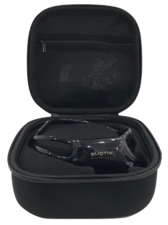
  <h4 align="center"><i>Ilustración 1: Contenido de la funda.</i></h4>
</div>


En la sección superior con cremallera del estuche, encontrará el paquete de sensores, el cable de carga USB y un pendrive USB universal. En la parte inferior, tienes el auricular y la diadema extraíble que se engancha como se muestra a continuación.


<div align="center">

  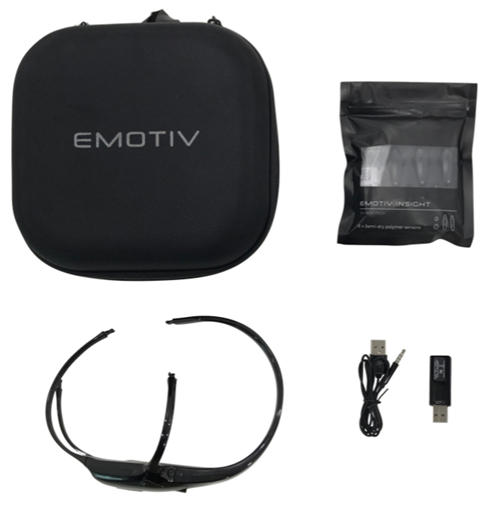
  <h4 align="center"><i>Ilustración 2: Detalle del contenido.</i></h4>
</div>


La configuración de INSIGHT es muy rápida y sencilla. Los sensores están hechos de un polímero semiseco. Si no se utilizan, deben guardarse en el porta sensor dentro de la bolsa con cierre. Para facilitar la configuración, se ha colocado los sensores y el brazo de referencia. Ambos se encuentran cubiertos con una lámina protectora. Porfavor, retire la lámina de plástico.


<div align="center">

  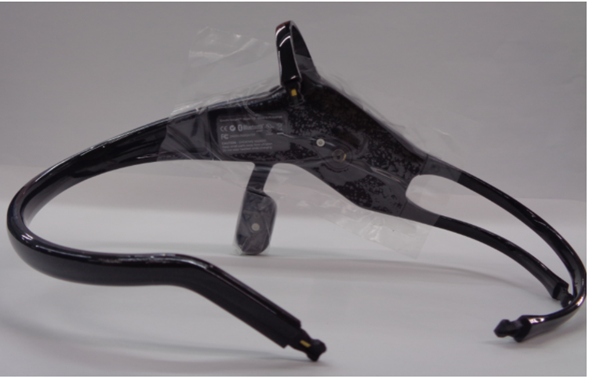
  <h4 align="center"><i>Ilustración 3: Cara interior del auricular INSIGHT con lámina protectora.</i></h4>
</div>


Por favor, localice el paquete de sensores como se muestra a continuación.

<div align="center">

  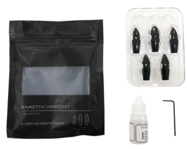
  <h4 align="center"><i>Ilustración 4: Contenido del paquete de sensores INSIGHT</i></h4>
</div>


El paquete de sensores tiene un sensor extra, para los usuarios con pelo grueso.


<div align="center">

  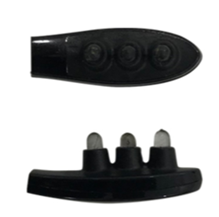
  <h4 align="center"><i>Ilustración 5: Sensor de 3 puntas.</i></h4>
</div>


Se recomienda utilizar el sensor de tres puntas. Este sensor está diseñado para tener una mejor penetración en el pelo y se recomienda su instalación en el brazo corto (parte superior del casco). Por favor, guarde los sensores de repuesto dentro del paquete de sensores para asegurar que no se sequen. Por favor, coloque los sensores en el auricular como se muestra a continuación.


<div align="center">

  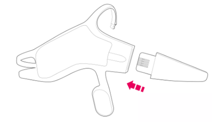
  <h4 align="center"><i>Ilustración 6: armado de INSIGHT.</i></h4>
</div>


<div align="center">

  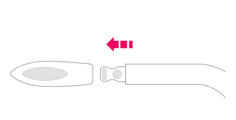
  <h4 align="center"><i>Ilustración 7: Unión de sensores.</i></h4>
</div>


<div align="center">

  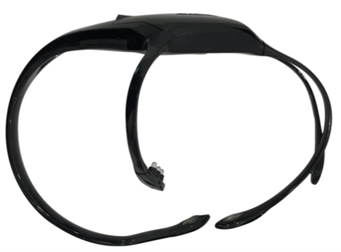
  <h4 align="center"><i>Ilustración 8: INSIGHT con sensores.</i></h4>
</div>

Antes de cada uso, se recomienda mojar los sensores con una pequeña cantidad de líquido para que no estén secos.


<div align="center">

  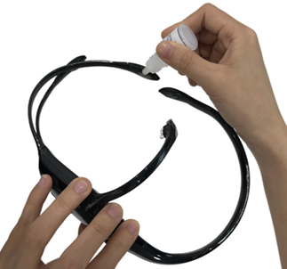
  <h4 align="center"><i>Ilustración 9: Mojando sensores.</i></h4>
</div>

El casco se enciende pulsando el interruptor de encendido que se encuentra en la parte superior; véase la imagen siguiente.


<div align="center">

  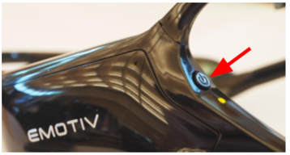
  <h4 align="center"><i>Ilustración 10: Botón de encendido.</i></h4>
</div>

Cuando la unidad está encendida, se enciende la luz indicadora blanca cuya ubicación se muestra a continuación.


<div align="center">

  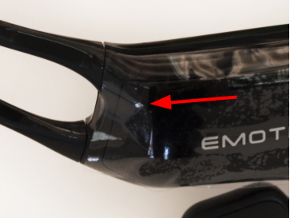
  <h4 align="center"><i>Ilustración 11: Luz de encendido.</i></h4>
</div>

El auricular puede ahora conectarse al pendrive través de Bluetooth Baja Energía y comenzará a transmitir datos.

Antes de colocar los auriculares, añada el líquido de imprimación del paquete de sensores en cada uno de los cinco sensores y en ambas referencias. Encienda el casco, asegurándose de que el LED blanco de la parte delantera se ilumina y conéctelo a través de Bluetooth Baja Energía al pendrive USB antes de colocarlo en la cabeza.

Deslice suavemente el auricular sobre la cabeza. Los sensores de referencia, que están en el brazo negro, deben hacer contacto con la piel detrás de la oreja. Si es necesario, doble suavemente el brazo del sensor de referencia para que los sensores entren en contacto con la piel. Los sensores frontales deben colocarse a unos tres dedos de distancia por encima de las cejas. A continuación se muestra una serie de imágenes para su correcta postura. Con la goma de tres puntas deslicela hacia adelante y hacia atrás para que los sensores atraviesen el cabello y hagan contacto con el cuero cabelludo.


<div align="center">

  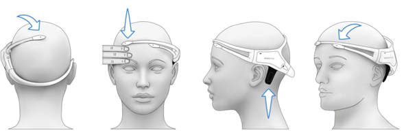
  <h4 align="center"><i>Ilustración 12: Cómo colocar el INSIGHT.</i></h4>
</div>


<div align="center">

  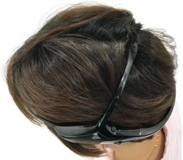
  <h4 align="center"><i>Ilustración 13: Ejemplo 1 usando INSIGHT.</i></h4>
</div>


<div align="center">

  
  <h4 align="center"><i>Ilustración 14: Ejemplo 2 usando INSIGHT.</i></h4>
</div>

## Interfaz de Configuraciones

La totalidad de las configuraciones del software LifewareIntegra se llevan a cabo en la ventana principal o de configuración (ver ilustración 15). Esta consta de varias secciones y cada una se encarga de un aspecto del software en particular.

La ventana principal o de configuración, tendrá bloqueada la acción de iniciar en caso de que el dispositivo Insight esté apagado, no esté emparejado con el sistema, esté descargado, muy alejado del receptor (2 metros o más de distancia entre el receptor USB y el dispositivo, o exista interferencia), o cuando el receptor USB no esté conectado al computador (como se muestra en la ilustración).


<div align="center">

  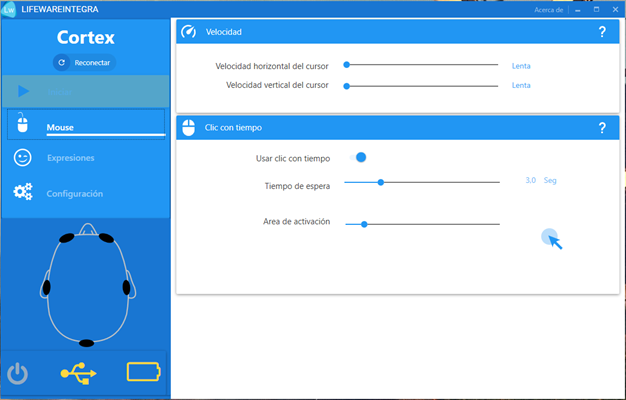
  <h4 align="center"><i>Ilustración 15: Ventana principal o de configuración.</i></h4>
</div>


Para acceder a todas las secciones es necesario encender y conectar el dispositivo. Allí se desplegará el cuadro de configuraciones como lo muestra la Ilustración 16.

:::note
El dispositivo puede demorarse entre 1 a 18 segundos en detectar que se encienda.
:::

<div align="center">

  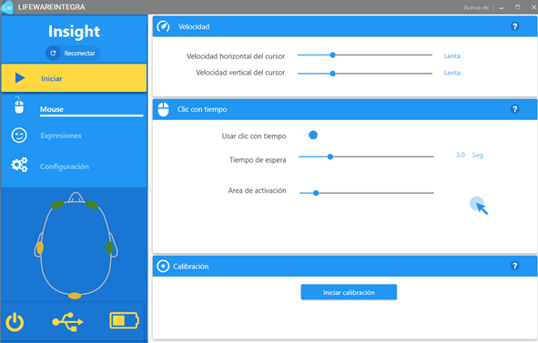
  <h4 align="center"><i>Ilustración 16: Botón de iniciar operativo.</i></h4>
</div>


### ESTADO DE DISPOSITIVO


<div align="center">

  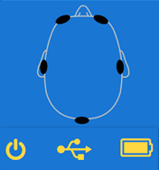
</div>


El dibujo representa el estado del casco y sus distintas características para el correcto funcionamiento del sistema.

### Sensores


<div align="center">

  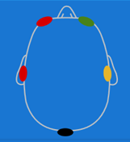
</div>


Estos pueden presentar 4 colores:


- Negro: El sensor no detecta contacto con la piel del usuario.
- Rojo: El sensor detecta levemente contacto con la piel del usuario, necesita ajustar un poco para la correcta detección.
- Amarillo: El sensor detecta contacto con la piel del usuario, puede detectar con un 50% de eficiencia.
- Verde: Correcto contacto con la piel del usuario, puede detectar las acciones y muecas del usuario sin problemas.


Lo ideal es que estén todos los sensores en verde, pudiendo haber algunos en amarillo.

Estos pueden verse afectados por interferencia entre el sensor y la piel, como el pelo; por lo que se recomienda tratar de mantener los sensores lo más apegado a la piel.

### Estado casco


<div align="center">

  
</div>


Esta barra determina si el sistema puede ejecutarse, y de no poder hacerlo, identificará el problema.

### Conectividad Bluetooth


<div align="center">

  
</div>


Este es el ícono más importante: Determina si el conector Bluetooth está correctamente instalado. Solo aparecerá disponible cuando el dispositivo Insight aparece como conectado o emparejado.

Si esta opción aparece deshabilitada, el sistema nunca podrá iniciar.


<div align="center">

  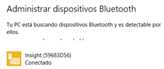
</div>


### Encendido


<div align="center">

  
</div>


Este icono sólo podrá ser detectado si el casco está encendido con energía y conectado.

### Batería


<div align="center">

  
</div>


Este icono solo se muestra si los 2 Iconos anteriores se encuentran encendidos.

Muestra el nivel de batería que presenta el dispositivo.

:::note
Puede que el icono de batería aparezca apagado y los demás iconos encendidos, sin dificultar el uso de la aplicación. Esto puede deberse a la detección interna del propio casco (lo cual no indica que presente fallos), para solucionar esto debe presionar la opción reconectar o volver a iniciar la aplicación.
:::

## Menú de opciones

En el extremo superior izquierdo se encuentran las tres secciones para iniciar la configuración, podrá ingresar haciendo clic en cualquiera de las opciones.

### RECONECTAR


<div align="center">

  
</div>


Esta opción, sirve en caso de que pasados los 18 segundos, el casco no sea detectado.

Esta opción tratará de reconocer el casco en caso de que esté encendido, habilitando su botón de inicio.

:::note
En caso de no detectar el casco, después de usar reconectar, cerrar la aplicación e intentar nuevamente. También considerar que el casco pueda presentar baja batería y necesite recargarse.
:::


### MÓDULO MOUSE

Al iniciar el software, se encontrará directamente en el módulo MOUSE. En caso de estar en cualquiera de los otros módulo, podrá ingresar haciendo clic nuevamente en la opción MOUSE.

Este módulo permite realizar los ajustes necesarios, para tener un adecuado control del cursor.


<div align="center">

  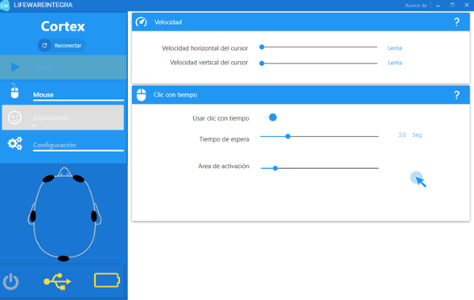
</div>


Este Módulo se encuentra dividido en tres subsecciones:

#### Velocidad


<div align="center">

  
</div>


El cursor se desplazará dependiendo del movimiento al que sea sometido el dispositivo. Esta opción permite realizar los ajustes para un adecuado control del movimiento del cursor.

Se puede realizar el ajuste de la velocidad del cursor, dependiendo del eje en que se realice el movimiento, ya sea horizontal o vertical. Cada una de las opciones cuenta con una barra configurada en nivel medio. Podrá asignarle una mayor o menor velocidad, moviendo el deslizador de color azul a la izquierda (menos) o a la derecha (más).

Esto, permitirá ajustar el desplazamiento del cursor, dependiendo de la movilidad que tenga el dispositivo; resultando que a mayor velocidad del cursor, se requerirá un menor movimiento del dispositivo para desplazar el mouse.

#### Clic con tiempo
En esta subsección, se permite modificar el tiempo de activación del clic automático. Cuando el cursor, permanezca lo suficientemente quieto, por el tiempo determinado por el usuario, se realizará la acción del clic.

La característica de usar clic con tiempo es opcional. Para utilizar debe activar/encender la opción haciendo clic en el botón azul.


<div align="center">

  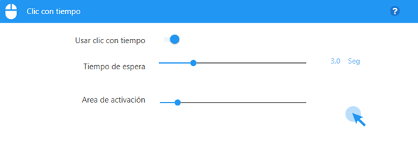
</div>


Para el correcto funcionamiento se deben establecer los parámetros de“clic con tiempo”, que se refieren al tiempo que debe mantenerse el mouse inactivo para desencadenar la acción del clic. Para aumentar el tiempo, desplace la barra de control asociada hacia la derecha. Asimismo, desplace la barra de control hacia la izquierda para disminuir el tiempo de inactividad requerido.

El “Área de Activación” corresponde al parámetro con el que se considerará inactivo el mouse y que simboliza el círculo celeste alrededor del cursor. Un área mayor de activación, significa que será más fácil permanecer en estado de inactividad. Un área menor de activación hace más difícil permanecer en estado de inactividad.

Para modificar el Área de Activación, mueva hacia la izquierda o derecha la barra de control asociada para disminuir o aumentar el nivel respectivamente. Un círculo celeste le permitirá visualizar el área de activación, lo que implica que una vez que, el usuario deje de mover el dispositivo Insight en un determinado punto, el sistema comprobará que si el cursor no escapa de un espacio imaginario durante el tiempo establecido se realizará la acción del clic.

### MÓDULO EXPRESIONES


<div align="center">

  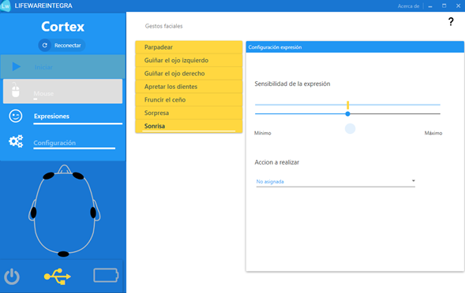
</div>


En esta sección se evalúan las distintas expresiones disponibles para permitir el funcionamiento del software LifewareIntegra: Parpadeo, Guiño ojo izquierdo, Guiño ojo derecho, Apretar los dientes, Fruncir el ceño, Sorpresa, Sonrisa.

Esta sección sirve para evaluar la detección de las expresiones. Para ello puede seleccionar una o varias expresiones en la lista de expresiones. Por ejemplo si está seleccionado “Parpadeo”, el medidor de sensibilidad, muestra la detección de la expresión y lo expresa en la barra horizontal. El círculo azul o “visto bueno” se encenderá cuando detecte la acción correctamente (este puede presentar 1 segundo de retraso en la detección).

Puede modificar los parámetros para permitir o mejorar la detección de esta expresión. En caso de que no se detecte la expresión, es recomendable aumentar la sensibilidad moviendo el deslizador azul hacia la izquierda. En caso de que el programa detecte la expresión y el usuario no la esté haciendo (no se realiza la acción pero se enciende el círculo azul o “visto bueno”), se debe disminuir la sensibilidad moviendo el deslizador azul hacia la derecha.

Una vez que sea posible controlar una determinada expresión facial, se le puede asignar una función. Para ello se debe seleccionar una acción del menú “ACCIÓN A REALIZAR”; allí se podrán seleccionar las siguientes acciones: Clic Izquierdo,Clic Derecho, Doble Clic, Arrastrar.

Para tener una mejor detección de las expresiones faciales, se requiere que los sensores estén correctamente posicionados.

NOTA: Algunas expresiones presentan mejor resultado de detección que otras, esto debido a como se acomode el casco a la cabeza del usuario, existen casos en los cuales algunos gestos funcionan con algunos usuarios y con otros usuarios no.

Los gestos más sensibles y recomendados para el usuario son:

1. Parpadeo
2. Guiño izquierdo
3. Guiño derecho

### MÓDULO CONFIGURACIÓN

<div align="center">

  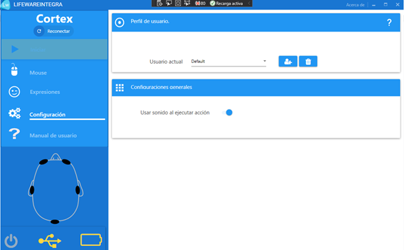
</div>

En este módulo se puede crear/eliminar un perfil de usuario el cual guardará la última configuración determinada. El perfil creado estará disponible la próxima vez que el usuario inicie sesión.

En caso de no crear ningún usuario se cargará automáticamente uno denominado “default”.


<div align="center">

  
</div>


<div align="center">

  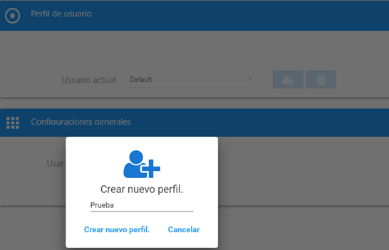
</div>

Además, puede establecer el uso del sonido para las acciones del mouse. 

<div align="center">

  
</div>

Como se muestra en la imagen anterior, se puede activar o desactivar la opción de sonido para las acciones del mouse. Es decir, cuando se ejecuta alguna acción del mouse y  se cuenta con la acción del sonido habilitada, se escuchará un pequeño sonido.

### MÓDULO MANUAL DE USUARIO

<div align="center">

  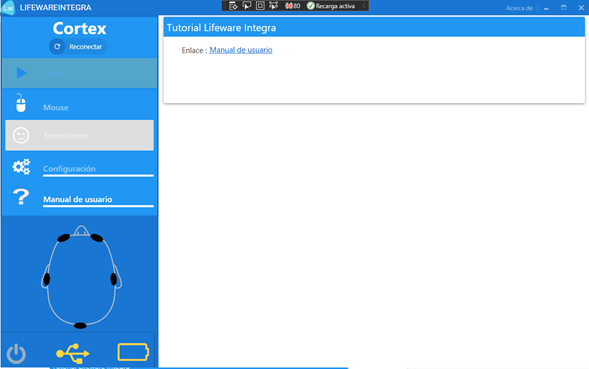
</div>

Este módulo cuenta con una redirección hacia una página que contiene el manual de usuario para lifewareintegra.

<div align="center">

  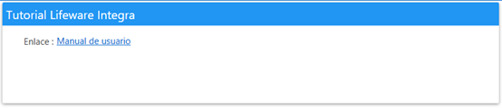
</div>

Una vez completada la configuración, entre ellas determinando la sensibilidad del cursor, el uso o no de expresiones faciales, la asignación de acciones, el uso o no de clic por tiempo, se procede a dar inicio al funcionamiento 


<div align="center">

  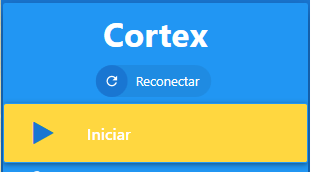
</div>


## Uso del Software

Al iniciar el funcionamiento, desaparecerá el menú de configuración brindando acceso a dirigir el cursor con el movimiento de la cabeza según las funcionalidades previamente asignadas. Podrá detener el funcionamiento del software presionando las teclas **CTRL+L** , retornando inmediatamente al menú de configuración.


### Menú lateral

Al dar inicio al funcionamiento del software LifewareIntegra,se ocultará el menú de configuración, a su vez se desplegará un menú en la parte derecha de la pantalla, con el cual se puede complementar el uso del mismo.


<div align="center">

  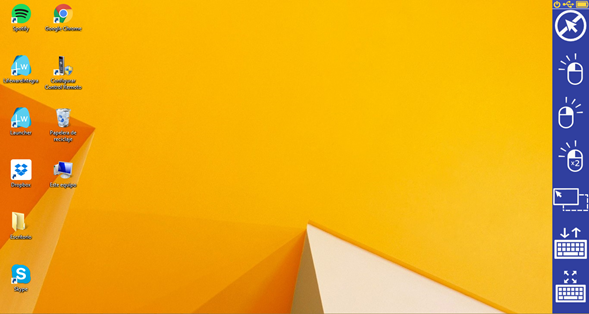
</div>


Este menú cuenta con las siguientes opciones :

● **Desactivar acción del Mouse :** 

Esta función permite desactivar/activar la acción asignada al mouse. Por ejemplo, si se tiene configurado el clic con tiempo, éste dejará de efectuar la acción de hacer el clic. Se desactivará posicionando en esta opción nuevamente el cursor por un par de segundos (Esta opción facilita cuando el usuario visualiza vídeos, evitando acciones involuntarias)

● **Clic Izquierdo :** 

Esta función activa que la próxima acción que se realice con el mouse corresponda a un Clic izquierdo.

● **Clic Derecho :** 

Esta función activa que la próxima acción que se realice con el mouse corresponda a un Clic derecho.

● **Doble Clic** 

Esta función activa que la próxima acción que se realice con el mouse corresponda a un doble Clic izquierdo.

● **Mover/Arrastrar :** 

Esta función, activa que la próxima acción que se realice con el mouse corresponda a mantener Clic izquierdo presionado, permitiendo mover o arrastrar algún ícono, o seleccionar uno o varios elementos de la pantalla. Esta función consta de 2 pasos: el primer clic simulará la mantención del clic izquierdo presionado y el segundo clic que se realice simulara soltar el clic presionado.

● **Mover el Teclado en Pantalla :** 

Esta opción permite cambiar de posición el teclado virtual desplegado en la pantalla, lo traslada desde una posición inferior, lo posiciona en la parte superior de la pantalla y viceversa. En caso de que el teclado no esté desplegado, lo desplegará automáticamente.

●**Cambio de Tamaño del Teclado en Pantalla :** 

Esta opción permite cambiar el tamaño del teclado en pantalla, podrá aumentar/reducir el tamaño dependiendo de la necesidad del usuario. En caso de que el teclado no esté desplegado, lo desplegará automáticamente.

## Comentarios

:::important
El software puede funcionar en computadores que cuenten con Windows 10 (Professional, Home Single Lenguaje) pero su soporte no es oficial para sistemas operativos anteriores,por lo que Lifeware S.P.A no asegura su correcto funcionamiento.
:::

:::caution
“Lifeware”, “Lifewareintegra y su srespectivos logotipos son marcas comerciales registradas de Lifeware S.P.A en Chile y/o en otros países.
:::

:::caution
“Windows”, “WindowsXP”, “WindowsVista”, “Windows7”, “Windows8”, “Windows10” son
marcas comerciales de Microsoft Corporation en Estados Unidos y/o en otros países y no tienen relación alguna con Lifeware S.P.A.
:::
:::caution
“Insight” y “Emotiv” son marcas comerciales de Emotiv Systems en Australia y/o en otros países y no tienen relación alguna con Lifeware S.P.A.
:::
:::caution
Se prohíbe la copia total o parcial de forma digital, foto copia, off set o cualquier otro medio mecánico o digital de este documento así como de cualquier componente de software, material audio visual página web y cualquier otro material del que la empresa LifewareS.P.A. Posea derechos, sin la autorización por escrito deLifeware S.P.A.
:::


