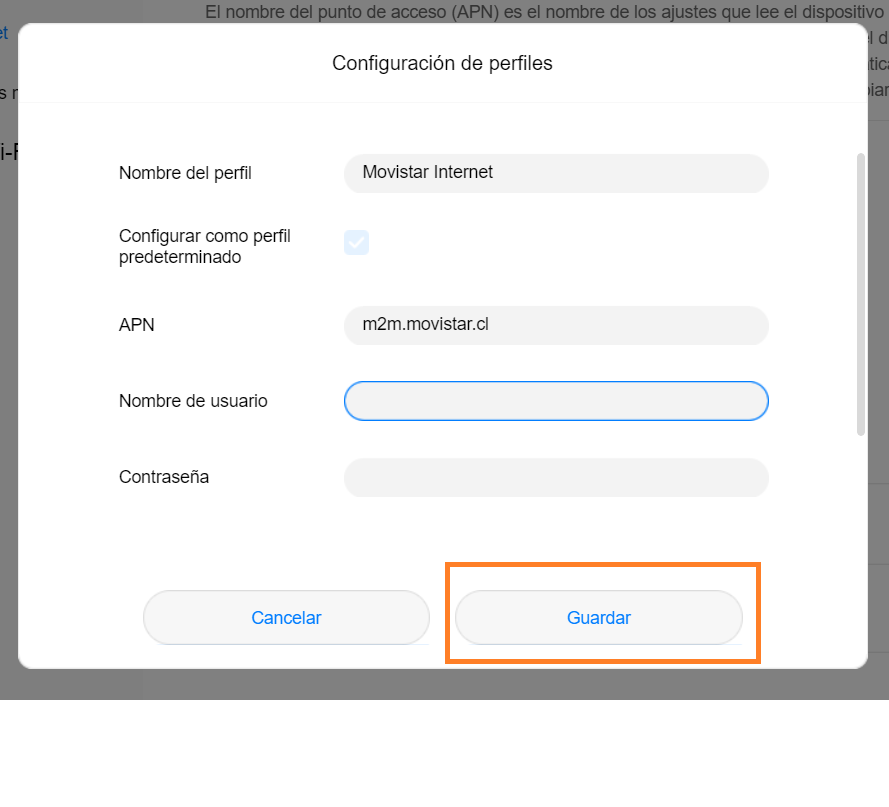

Índice

1. [Creación del perfil falla](#1-creación-del-perfil-falla)
2. [No puedo acceder a la página](#2-no-puedo-acceder-a-la-página)
3. [Volver a los valores de fabrica](#3-volver-a-los-valores-de-fabrica)

## 1. Creación del perfil falla

Si llega hasta la parte final del tutorial y aun no cuenta con acceso a internet, es posible que los datos del perfil creado estén con algún problema. Para ello diríjase a la siguiente sección como muestra en la imagen.

La diferencia con esta sección es que, entre los perfiles creados, debe aparecer uno cuyo nombre es “Movistar internet”. Al encontrarlo, debe editar los datos, si no se encuentra, debe crear un nuevo perfil en el “+” que aparece en la imagen anterior. Los datos que debe ingresar son los siguientes:

Nombre del perfil: Movistar Internet

APN: m2m.movistar.cl

:::caution Asegúrese de que no exista ningún espacio en el campo **APN**, ya que algunas formas de escritura suelen incorporar un espacio luego de un punto. :::

Luego de ingresar los datos, debe guardar y salir, con este cambio en unos minutos tendrá acceso a internet.

## 2. No puedo acceder a la página

Se muestra la pagina web o pagina de inicio a continuación.

Durante la configuración del modem, existe un paso donde cambia la clave de entrada a la pagina web.

En la imagen anterior se muestra cómo se cambio la clave de inicio en la página. Por lo tanto, para ingresar a la pagina de inicio, debe ingresar la **KEY** como contraseña (referente a los datos extraídos del dispositivo modem).

Si la clave **Key** no le funciona para ingresar a la página, lea la sección que viene a continuación.

## 3. Volver a los valores de fabrica

Si cuenta con problemas de acceso ya se a acceso a pagina web de inicio o intentando conectarse a la red del modem. Se sugiere reiniciar el modem a su estado de fábrica. Para ello debe presionar el botón que se en la zona que muestra la siguiente imagen.

Luego de reiniciar el modem, puede volver a intentar los pasos de la [guía] de manera normal.

[guía]: ./manual-lifewareintegra.md

:::caution Asegúrese de presionar el botón mientras el dispositivo se encuentra encendido, es decir mientras esta la batería conectada y la luz de encendido permanezca en su lugar. :::
:::warning Tenga presente que, se puede salir la batería mientras intenta presionar el botón de reinicio a su estado de fábrica. :::
